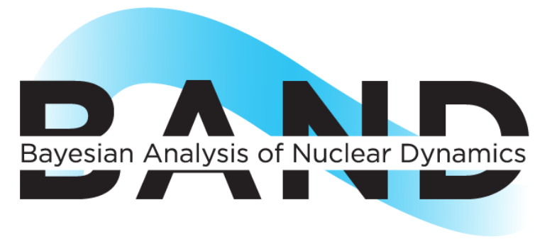
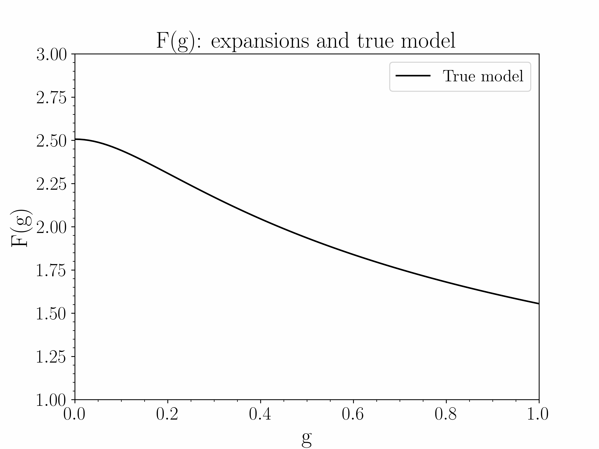

<!-- #region -->
# SAMBA package: SAndbox for Mixing using Bayesian Analysis


Bayesian model mixing is a novel concept that surpasses the more widely used Bayesian model averaging (BMA) in its use of location-dependent weights, allowing multiple models to dominate in regions where they are the most accurate model known, instead of averaging over all of the models in the space. In this repo, we store the preliminary code and tests of three model mixing techniques studied on a test case meant to symbolise the type of nuclear physics problem we want to apply these methods to in the future. This will, in the next few months, be compiled into a package to be released this spring/summer (2022) under the name of SAMBA---SAndbox for Mixing using Bayesian Analysis. This accompanies the paper we have posted to arXiv (see the paper [here](https://arxiv.org/abs/2206.04116)) where we detail our work using these techniques on our toy problem: the zero-dimensional $\phi^{4}$ theory partition function.


## About 

This package is intended to contain a variety of methods to perform Bayesian Model Mixing on a given set of data points and errors across an input space. In the current version, it can apply three different BMM methods to series expansions in the limits of a coupling constant. In future versions, we will include the option for users to implement their own functions or data sets to mix using SAMBA. It is a part of the BAND collaboration's v0.2 software. 

For our documentation, visit our Docs page: https://asemposki.github.io/SAMBA/.




## Citing SAMBA

To cite our software repository, please use

```
   @techreport{SAMBAacs,
     author      = {Semposki, A. C. and Furnstahl, R. J. and Phillips, D. R.},
     title       = {{SAMBA 1.1.0} SAndbox for Mixing using Bayesian Analysis},
     number      = {Version 1.1.0},
     year        = {2024},
     url         = {https://github.com/asemposki/SAMBA}
   }
```

To cite our accompanying scientific publication, use

```
   @article{Semposki:2022gcp,
      author = "Semposki, A. C. and Furnstahl, R. J. and Phillips, D. R.",
      title = "{Interpolating between small- and large-g expansions using Bayesian model mixing}",
      eprint = "2206.04116",
      archivePrefix = "arXiv",
      primaryClass = "nucl-th",
      doi = "10.1103/PhysRevC.106.044002",
      journal = "Phys. Rev. C",
      volume = "106",
      number = "4",
      pages = "044002",
      year = "2022"
    }
```

## Workflow 

- Instantiate an object using the method of your choice (`LMM` (linear mixture model), `Bivariate` (bivariate BMM), or `GP` (trivariate BMM with a GP)) and select the truncation orders for the small-$g$ and large-$g$ expansions. 


- Mix the models using the provided functions in the method classes listed above. 

Refer to the Tutorials folder in the repo for a comprehensive set of notebooks on how to implement SAMBA on the current toy model setup. 

An animated `.gif` of our toy models is below. 

<p align="center">
  
</p>

## Testing

At its present status, there are two ways to test SAMBA:

- After cloning this repo, make sure you have all of the required packages installed (see requirements.txt for a list of external packages needed) and open the docs/Tutorials folder. Open the 3 notebooks there and run each notebook. If each cell is free of any errors, SAMBA is working correctly!

- After cloning this repo, open a terminal and go to the Tests folder. This contains two pytest-compatible files (stay tuned for more!) that test the Bivariate and GP methods. Type `pytest` in your terminal and it should run both of the files. If all tests are passing and only a couple of warnings (about external packages) show up, SAMBA is passing its tests!
<!-- #endregion -->
